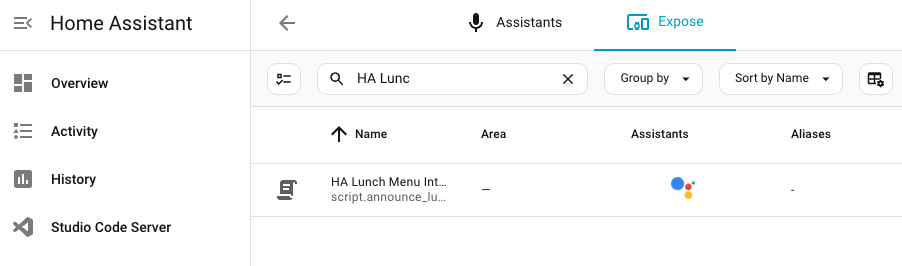
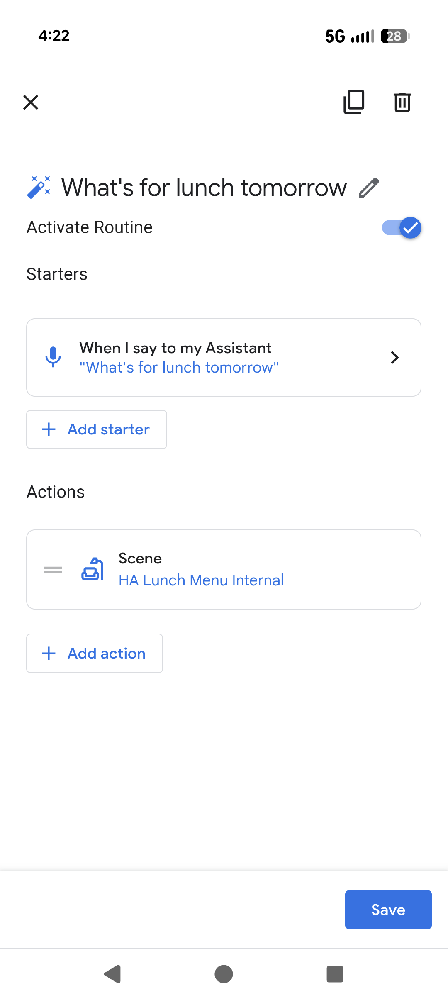

# Voice Command for Tomorrow's School Lunch Menu

## Requirements

  * Your school menu needs to be served by Nutrislice. Check on https://lookup.nutrislice.com/en/.
  * You need to use [Nabu Casa](https://www.nabucasa.com/).
    * a free alternative is a custom domain + Cloudflare tunnel + https://console.home.google.com project +  GCP HomeGraph API web app. Instructions below are for Nabu Casa but can be adapted.
  * You're using the Google Home/Nest ecosystem.
  * You're using the default Google Translate for TTS.

  ## Instructions

### configuration.yaml
``` yaml
automation: !include automations.yaml
script: !include scripts.yaml
sensor: !include sensors.yaml
```

### sensors.yaml
Fill in `<DISTRICT ID>` and `<SCHOOL ID>`, school start and end dates, and also school holidays.

``` yaml
platform: rest
name: School Lunch Menu
unique_id: school_lunch_menu
resource_template: >
  {# IMPORTANT: Replace the two placeholders below with your district ID and school ID. #}
  
  https://<DISTRICT ID>.api.nutrislice.com/menu/api/weeks/school/<SCHOOL ID>/menu-type/lunch/{{ tomorrow.strftime('%Y/%m/%d') }}           
value_template: >
  
  {% set tomorrow_str = tomorrow.strftime('%Y-%m-%d') %}
  
  {# IMPORTANT: Update school_start and school_end with your school's calendar dates. #}
  {# Add any additional holidays (teacher workdays, spring break, etc.) to the holidays list. #}
  
  
  
  
    There's no school lunch tomorrow. It's summer break.
  
    There's no school lunch tomorrow because it's the weekend.
  
    There's no school lunch tomorrow. It's a school holiday.
  
    
    
      
        
          
            
            
              
            
          
        
      
    
    
      School lunch is {{ items.list | join(', ') }}.
    
      I couldn't find the lunch menu for tomorrow.
    
  
scan_interval: 86400
```

### automation.yaml
``` yaml
- alias: Pre-fetch Lunch Menu
  id: prefetch_lunch_menu
  description: Refreshes lunch menu cache
  trigger:
    - platform: time
      at: 00:05:00
    - platform: homeassistant
      event: start
  condition:
    - condition: time
      weekday:
        - sun
        - mon
        - tue
        - wed
        - thu
  action:
    - service: homeassistant.update_entity
      target:
        entity_id: sensor.school_lunch_menu
```
### Restart and Test
1. Go to Developer Tools and do a full restart (not quick reload)
1. Go to Settings > Automations & Scenes > Pre-fetch Lunch Menu and `Run actions`
1. Go to Develop Tools and `States` and find the `sensor.school_lunch_menu` and make sure it's populated with the correct value based on the logic in `sensors.yaml` for `school_lunch_menu`.
### scripts.yaml
``` yaml
announce_lunch_menu:
  alias: HA Lunch Menu Internal
  description: Announces tomorrow's school lunch menu on the speaker
  sequence:
    - service: tts.speak
      target:
        entity_id: tts.google_translate_en_com
      data:
        media_player_entity_id: media_player.<speaker entity ID> # Replace with ID for your speaker
        message: "{{ states('sensor.school_lunch_menu') }}"
```
### Restart and Test
1. Go to Developer Tools and do a full restart (not quick reload).
1. Go to Settings > Automations & Scenes > Scripts > HA Lunch Menu Internal and `Run`

### Google Assistant
1. In Home Assistant [Settings > Voice assistants > Google Assistant > Expose](http://homeassistant.local:8123/config/voice-assistants/expose), expose the `HA Lunch Menu Internal` script by clicking the `+ Expose Entities` button (in the bottom right corner).



### At Home
Say `Ok Google, sync my devices` which is a special command.

### Google Home app
Create an automation for the `What's for lunch tomorrow` voice command. Note, the script will be listed as a `Scene` in the Home app under `Adjust Home Devices`. You may have to use the `Previous household editor` to be able to select a scene as an action.



### Test

Say `Ok Google, what's for lunch tomorrow` and see if it's the answer you expect.

## Tweaks
### Use Gemini for TTS
Install https://www.home-assistant.io/integrations/google_generative_ai_conversation/


Note, the voices on Gemini TTS do not match the voices in the Google Home app.
``` yaml
- action: tts.speak                                                                                                                        
  target:                                                                                                                                  
    entity_id: tts.google_ai_tts                                                                                                           
  data:                                                                                                                                    
    media_player_entity_id: media_player.<speaker entity ID>                                                                               
    message: "Read aloud in a warm and friendly tone with a low voice: {{ states('sensor.school_lunch_menu') }}"                           
    options:                                                                                                                               
      voice: Puck     
```
